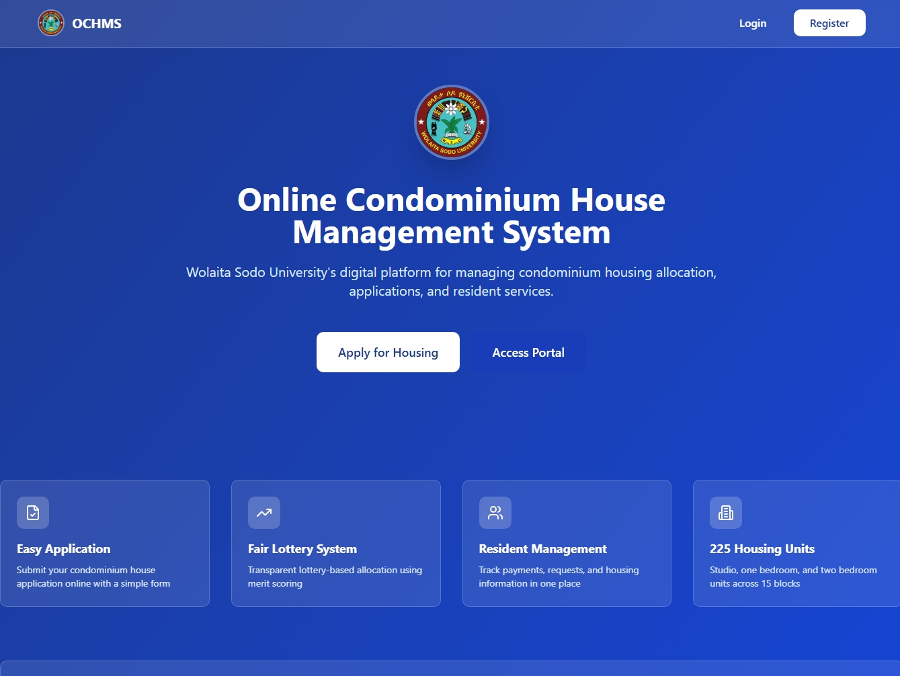
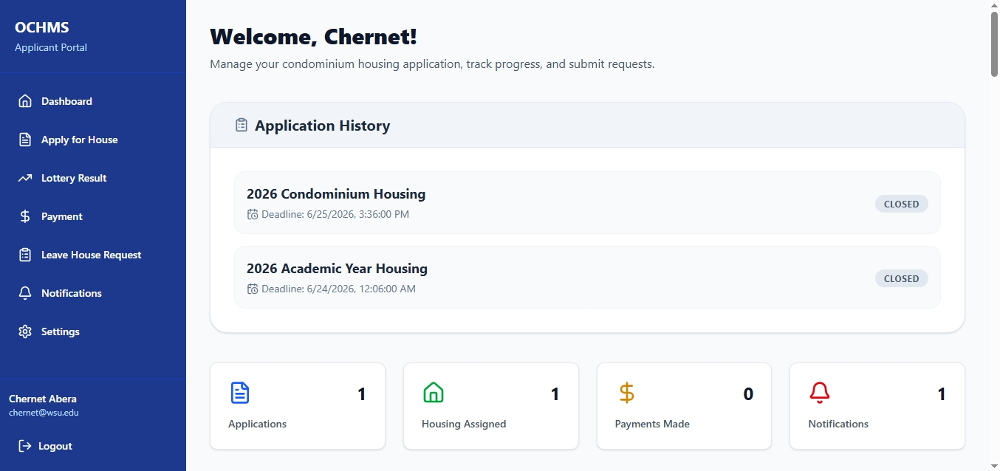
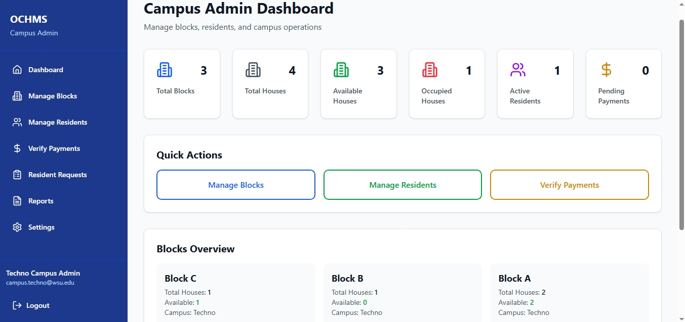
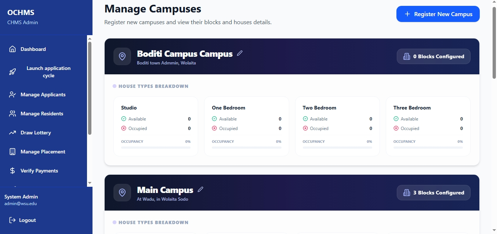
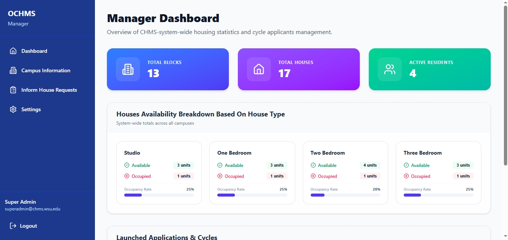
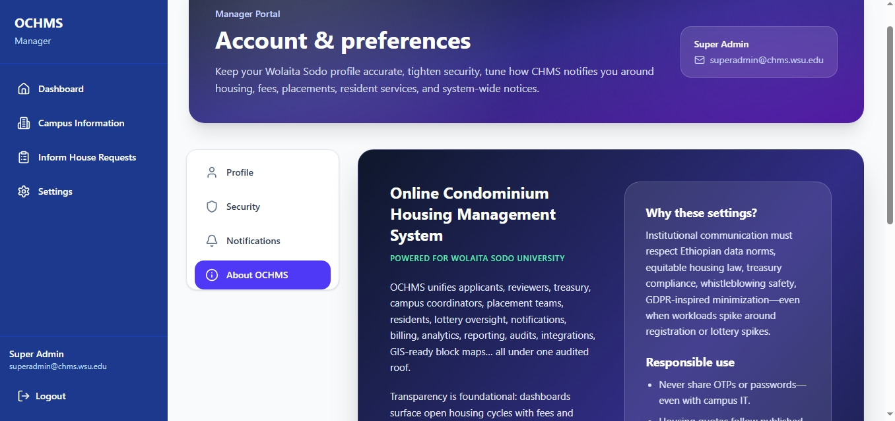
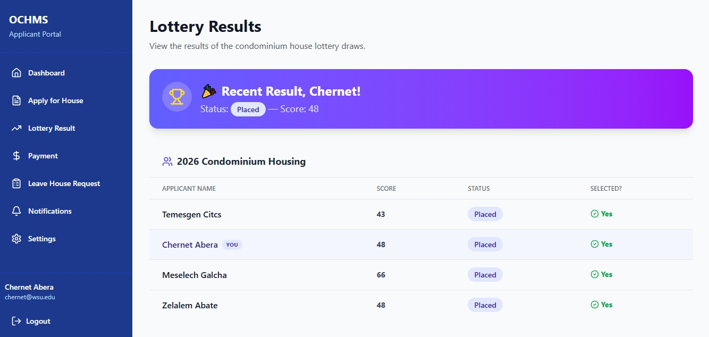

# Online Condominium House Management System (OCHMS)

A comprehensive web-based platform for managing condominium housing allocation, applications, and resident services at Wolaita Sodo University.


## 📋 Table of Contents

- [Overview](#overview)
- [Features](#features)
- [Technology Stack](#technology-stack)
- [User Roles](#user-roles)
- [System Architecture](#system-architecture)
- [Scoring Algorithm](#scoring-algorithm)
- [Screenshots](#screenshots)
- [Contributing](#contributing)
- [License](#license)

## 🎯 Overview

OCHMS is designed to replace the manual condominium management process at Wolaita Sodo University with a computerized, efficient, and transparent system. The platform manages:

- 🏢 **225 housing units** across 15 blocks
- 📝 **Application processing** with automatic scoring
- 🎲 **Fair lottery system** for house allocation
- 💰 **Payment management** (1,200 Birr/month)
- 📊 **Comprehensive reporting** and analytics
- 🔔 **Notification system** for applicants and residents

## ✨ Features

### For Applicants/Residents
- ✅ Online registration and application
- 📈 Real-time score calculation
- 🎯 Lottery result viewing
- 💳 Payment submission and tracking
- 📬 Notification reception
- 🏠 Leave house requests
- ⚙️ Profile management

### For Campus Admins
- 🏗️ Block and house management
- 👥 Resident oversight
- ✔️ Payment verification
- 📋 Request handling
- 📊 Campus-level reporting

### For CHMS Admin
- 👨‍💼 Full applicant management
- 🎲 Lottery draw execution
- 🏘️ House placement control
- 💵 System-wide payment verification
- 📢 Notification broadcasting
- 📈 Comprehensive analytics
- 🌍 Multi-campus management

### For Super/Managerial Admin
- 👨‍💼 Monitor whole applicants
- 🎲 Chech the transpancy of lottery excution
- 🏘️ See each campuses detail info
- 📈 Control nominated houses
- 🌍 Multi-campus management

## 🛠️ Technology Stack

### Frontend
- **React** 18.3.1 - UI framework
- **TypeScript** - Type-safe JavaScript
- **React Router** 7.13.0 - Client-side routing
- **Tailwind CSS** 4.1.12 - Utility-first styling
- **Lucide React** - Icon library
- **Sonner** - Toast notifications
- **React Context API** - State management

### Development Tools
- **Vite** 6.3.5 - Build tool
- **ESLint** - Code linting
- **Prettier** - Code formatting

## 👥 User Roles

### 🎓 Applicant/Resident
Access to personal applications, lottery results, and payment management.

### 🏫 Campus Admin
Manages specific campus operations including blocks, residents, and local payments.

### 👑 CHMS/System Admin
Full system access with lottery control, placement authority, and global oversight.

### 👑 SUper/Managerial Admin
Full system monitor with application control, whole campus management, nomination Monitor, and global oversight.

## 🏗️ System Architecture

          ┌─────────────────────────────────────────────────────┐
          │                  Landing Page                       │
          └───────────────────────────┐─────────────────────────┘
                                      |
                                      ▼
            ┌────────────-────────────┐────────────────────────┐
            │            │            │                        |
            ▼            ▼            ▼                        ▼
    ┌──────────┐  ┌──────────┐  ┌──────────┐             ┌──────────┐
    │Applicant │  │  Campus  │  │ System   │             |Manageral |
    │Dashboard │  │  Admin   │  │  Admin   │             |Admin     | 
    └──────────┘  └──────────┘  └──────────┘             └──────────┘
         │              │              │                       |
         │              │              │                       |
    ┌────┴────┐    ┌────┴────┐    ┌────┴────┐             ┌────┴────┐
    │Apply    │    │Manage   │    │Lottery  │             │Monitor  │
    │Payment  │    │Blocks   │    │Placement│             │whole    │
    │Lottery  │    │Verify   │    │Reports  │             │system   │
    └─────────┘    └─────────┘    └─────────┘             └─────────┘


### Key Components

- **AuthContext**: Manages user authentication and sessions
- **DataContext**: Centralized state management for all data
- **Layout**: Role-based navigation and layout wrapper
- **Routes**: Protected route configuration

## 📊 Scoring Algorithm

The system uses a weighted formula to rank applicants fairly:

### Score Components

| Criterion | Weight | Max Points | Calculation |
|-----------|--------|------------|-------------|
| **Academic Level** | 45% | 45 | Bachelor(25), Masters(35), PhD(45), Professor(50) |
| **Years of Service** | 15% | 15 | 1 point/year, max 10 years |
| **Job Responsibility** | 15% | 15 | Based on position level |
| **Marital Status with number of child** | 10% | 10 | Married(3), Single(1), Withchild? depends & 1 point/child |
| **Is Disable? Type?** | +15% | +15 | Depends on disability type |


### Example Calculation

```typescript
Applicant: PhD, 5 years service, Department Head, Married + 2 child, Missed 1 Limb
Score = 35 + (5×1) + 13 + (3 + 2) + 10 = 68 points
```

## 📸 Screenshots

### Landing Page

### Applicant/Resident Dashboard

### Campus Admins Dashboard

### System Admin Dashboard

### Super/Managerial Admin Dashboard

### User Account page

### Lottery Result Page

## 🗂️ Project Structure

```
ochms/
├── src/
│   ├── app/
│   │   ├── components/      # Reusable UI components
│   │   │   ├── ui/         # Shadcn UI components
│   │   │   ├── Layout.tsx
│   │   │   ├── StatCard.tsx
│   │   │   └── ...
│   │   ├── context/        # React Context providers
│   │   │   ├── AuthContext.tsx
│   │   │   └── DataContext.tsx
│   │   ├── pages/          # Route pages
│   │   │   ├── applicant/
│   │   │   ├── campus-admin/
│   │   │   └── chms-admin/
│   │   ├── utils/          # Utility functions
│   │   │   ├── scoreCalculator.ts
│   │   │   ├── validators.ts
│   │   │   ├── statistics.ts
│   │   │   └── exportHelpers.ts
│   │   ├── routes.tsx
│   │   └── App.tsx
│   └── styles/             # Global styles
├── public/                 # Static assets
├── SYSTEM_DOCUMENTATION.md # Full system documentation
└── README.md              # This file
```

## 🧪 Testing

### Manual Testing Checklist
### Test Coverage

| Test Type       |   Count |       Status        |
| --------------- | ------: | :-----------------: |
| Unit Tests      |      24 |     All Passing     |
| Component Tests |      15 |     All Passing     |
| E2E Tests       |      6  |     All Passing     |
| **Total**       |  **45** | **100% Pass Rate** |

---
## 🔐 Security Features

- ✅ Password encryption (simulated)
- ✅ Role-based access control (RBAC)
- ✅ Secure session management
- ✅ Input validation
- ✅ Protected routes
- ✅ XSS prevention

### Quality Assurance

- **Secret Management** — API keys stored securely in GitHub Secrets
- **Dependabot** — Automatic dependency updates
- **Automated Testing** — 45 tests run on every commit
- **PR Templates** — Standardized pull request format
- **Issue Templates** — Structured bug reports and feature requests

## 🌟 Key Highlights

- **Responsive Design**: Works on desktop, tablet
- **Real-time Updates**: Instant UI updates with state changes
- **Comprehensive**: All SRS requirements implemented
- **User-Friendly**: Intuitive interface for all user types
- **Extensible**: Easy to add features

## 📝 Business Rules

- Monthly payment: **1,200 Ethiopian Birr**
- Total housing units: **225**
- Total blocks: **15**
- Application scoring: **Automated and transparent**
- Lottery selection: **Score-based ranking**

## 🚧 Future Enhancement

-  Email notification system
-  SMS notifications
-  Online payment gateway
-  Mobile application
-  Advanced AI powered analytics dashboard
-  Multi-language support

## Deployment

The application is not deployed yet but, it's in the middle of approval request of condominium management system managerial sector.

## Contributing

Contributions, issues, and feature requests are welcome!

1. Fork this repository.
2. Create your feature branch.

```bash
git checkout -b feature/AdditionalFeature
```

3. Commit your changes.

```bash
git commit -m "Add some AdditionalFeature"
```

4. Push to your branch.

```bash
git push origin feature/AdditionalFeature
```

5. Open a Pull Request.

---

## Author

**Asayehu Abraham**

## Acknowledgments

- Built with ❤️ for Wolaita Sodo University.
- Inspired by the need for online condominium management system in Wolaita Sodo University.
- Icons provided by **Lucide**.
- Design inspired by modern SaaS applications.
- Thanks to the amazing open-source community.

---

## 📄 License

This project is developed for Wolaita Sodo University based on only SRS document written an internship period.

## 👨‍💻 Development Team

Developed based on Software Requirements Specification (SRS) for the Online Condominium House Management System at Wolaita Sodo University.

## 📞 Support

For support, email asetabraham9@gmail.com, or contact  (phone: +251 964 063 992).


**© 2026 Wolaita Sodo University - All Rights Reserved**

<div align="center">

### If you found this project helpful, please consider giving it a star!

Made with CITCS software company by Internship student Asayehu Abraham for Wolaita Sodo University

</div>
